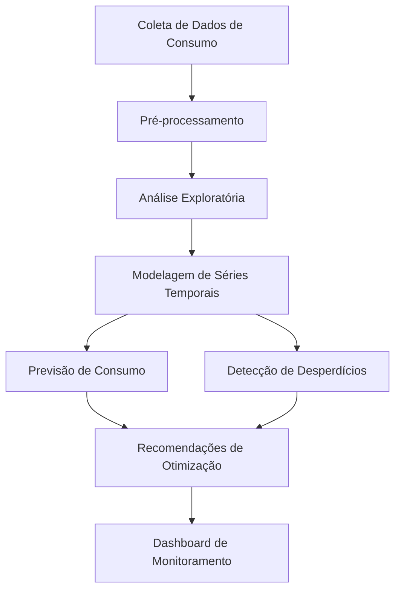

# SmartEnergyForecast
 
# **Documentação do Core do Projeto: Otimização do Uso de Energia com Séries Temporais**

## **1. Visão Geral**
O projeto tem como objetivo a **otimização do uso de energia elétrica** utilizando **análise de séries temporais** e **inteligência artificial**. A ideia principal é coletar dados de consumo energético, prever padrões de consumo, detectar desperdícios e sugerir melhorias para reduzir custos e otimizar o uso da eletricidade.

O sistema pode ser aplicado a **residências inteligentes**, **indústrias**, **empresas** e **companhias elétricas** para gerar insights baseados em análises matemáticas e físicas.

---

## **2. Diagrama de Fluxo do Projeto**

- **Coleta de Dados**: Aquisição de medições de consumo energético.
- **Pré-processamento**: Limpeza, normalização e tratamento dos dados.
- **Análise Exploratória**: Identifica padrões, sazonalidades e tendências.
- **Modelagem de Séries Temporais**: Seleção de modelos matemáticos para previsão e anomalias.
- **Previsão de Consumo**: Predição do consumo futuro baseado no histórico.
- **Detecção de Desperdícios**: Identifica picos de consumo anormais.
- **Recomendações de Otimização**: Sugere mudanças para reduzir gastos e melhorar eficiência.
- **Dashboard de Monitoramento**: Interface para visualizar dados e recomendações.

---

## **3. Conceitos Matemáticos e Físicos Utilizados**

### **3.1 Modelagem Matemática das Séries Temporais**

1. **Métodos Estatísticos**:
   - **ARIMA (Autoregressive Integrated Moving Average)**: Utilizado para modelar padrões de consumo e fazer previsões.
   - **Exponential Smoothing (Suavização Exponencial)**: Para capturar tendências e sazonalidades.

2. **Redes Neurais para Séries Temporais**:
   - **LSTM (Long Short-Term Memory)**: Redes neurais recorrentes especializadas em aprender padrões em séries temporais.
   - **Transformers para Séries Temporais**: Uso de mecanismos de atenção para previsões mais precisas.

3. **Detecção de Anomalias**:
   - **Isolation Forest**: Algoritmo para identificar pontos fora do padrão.
   - **Autoencoders**: Redes neurais para compressão e reconstrução de dados, ajudando a identificar outliers.

---

### **3.2 Cálculos Físicos Envolvidos**

1. **Cálculo do Consumo Energético**
   \[
   E = P \times \Delta t
   \]
   Onde:
   - \(E\) = Energia consumida (kWh)
   - \(P\) = Potência do dispositivo (kW)
   - \(\Delta t\) = Tempo de uso (h)

2. **Eficiência Energética**
   \[
   \eta = \frac{P_{util}}{P_{total}} \times 100\%
   \]
   Onde:
   - \(\eta\) = Eficiência do sistema
   - \(P_{util}\) = Energia útil gerada
   - \(P_{total}\) = Energia consumida total

3. **Análise de Pico de Demanda**
   - Identifica os momentos de maior consumo.
   - Auxilia na recomendação de mudanças de comportamento para economizar energia.

---

## **4. Tecnologias Utilizadas**

📌 **Linguagens:** Python (Pandas, NumPy, SciPy, TensorFlow, PyTorch), R (estatística).
📌 **Banco de Dados:** InfluxDB (armazenamento de séries temporais), PostgreSQL.
📌 **Modelos de Machine Learning:** ARIMA, LSTM, Prophet, Transformers.
📌 **APIs para Coleta de Dados:** OpenWeatherMap (dados climáticos), Google Home (IoT).
📌 **Frameworks de Visualização:** Streamlit, Dash, Power BI. 

---

## **5. Expansão do Projeto**

- **Integração com Energia Solar** 🌞
  - Prever geração de energia solar e ajustar consumo automaticamente.
  - Sugestão de melhores horários para consumo com base em radiação solar.

- **Automatização de Dispositivos** ⚡
  - Conectar com sistemas IoT para desligamento automático de aparelhos em momentos de pico.

- **Gamificação para Economia** 🏆
  - Criar um sistema de "pontos" que recompensa usuários por boas práticas energéticas.

---

## **6. Conclusão**

Este projeto utiliza **técnicas matemáticas, estatísticas e de machine learning** para prever consumo, detectar desperdícios e otimizar o uso da energia. Ele pode ser expandido para diversas aplicações e integrado com **fontes renováveis e IoT**, tornando-se uma ferramenta essencial para a sustentabilidade e economia de recursos.

📢 **Próximo passo:** Definir a arquitetura inicial do software e criar um protótipo funcional! 🚀

